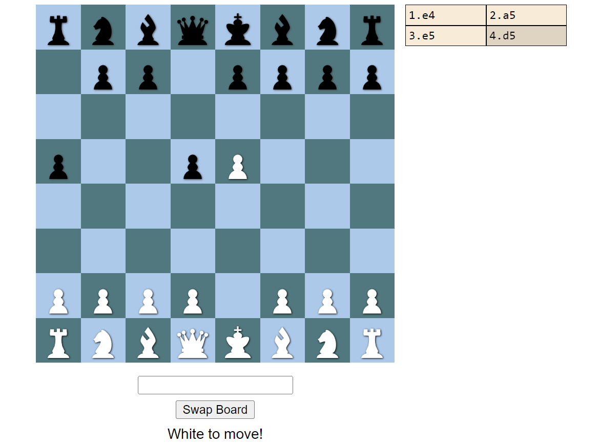

# Chess Webapp in F#

Client Side Chess SPA Written in F#. Try it out [here](https://erikps.github.io/chess-fs/).

The site features the ability to play over the board. On the right side there is an interactive history of the moves so far that can be explored by clicking on individual moves. 

## Install

1. Clone this repository.
2. Install dotnet dependencies  in the root folder.
    
    `dotnet restore`
3. Install npm dependencies
   
    `cd Web`
   
    `npm install`
4. Start the project in development mode.
    
    `npm run start`
5. Build the project for deployment. 
    
    `npm run build`. 
    
    The build artifacts can be found in `/Web/src/dist/`

## Implementation

The website is implemented in functional F# using the MVU (Model-View-Update) pattern. The apart from the website this repository also contains a console application that allows access to the same underlying chess implementation. Furthermore a utility to parse algebraic notation is available. 

There are three main modules of the project:
- **Core** -- Chess implementation.
- **Web** -- Consumes the Web module and provides a browser interface for it. 
- **Console** -- Alternative to Web which cam be used from a terminal.

The libraries used include:

- **Fable** to turn F# code into JavaScript for the browser.
- **Elmish** to facilitate the MVU architecture.
- **Feliz** for react bindings.

